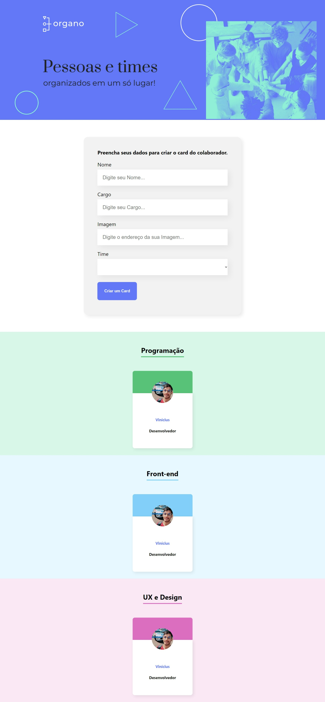

# Organo Team TI

> Projeto Organo

Projeto desenvolvido no curso da Alura com finalidade de desenvolver habilidades em React.js

Descrição: O site permite você organizar seu time de TI da sua empresa permitindo criar cards com nomes e um visual para cada equipe diferente.

[Clique aqui para acessar](https://vinidevit.github.io/organo/)

#  Tecnologias

>HTML

>CSS

>Javascript

>React

>JSX

>Figma

>Git e Github
